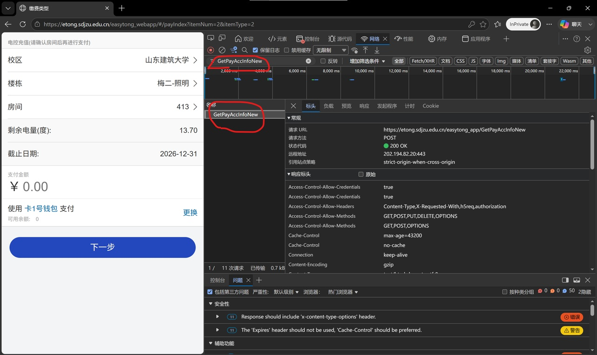
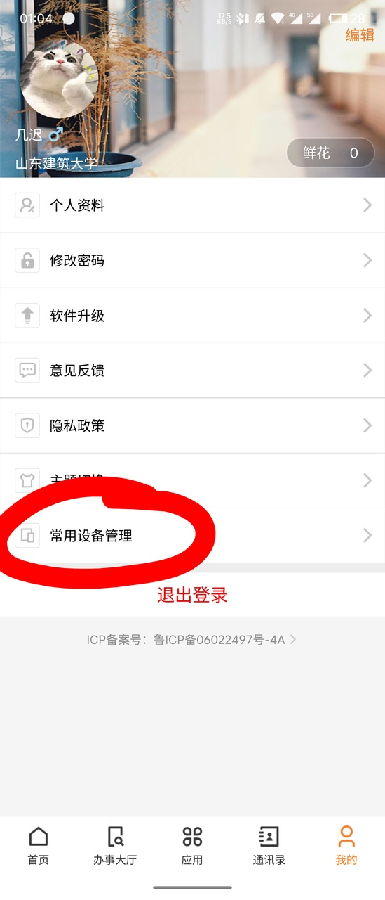

# 山东建筑大学电费监控服务

> 自动监控宿舍电费余额，低电量告警，每日推送电量报告

## ✨ 功能

- ⚡ **自动查询** - 定时查询电费余额
- 🚨 **低电量告警** - 余额低于阈值立即推送通知
-  **每日报告** - 每天 19:10 推送当日电量日报
- 🔑 **无需抓包** - 签名算法已逆向，自动计算 Sign
- 🏫 **双校区** - 自动识别济南/烟台校区
-  **零配置启动** - 无本地数据时自动通过 API 拉取房间列表
-  **多渠道推送** - 企业微信、Bark、PushPlus
- 🔐 **自动二次验证** - 首次运行通过手机浏览器完成图片验证码+短信验证码，后续自动免验证
- 🛡️ **浏览器指纹模拟** - 使用 curl_cffi 模拟 Chrome TLS 指纹，防止 CTTICKET 过期

## 📦 快速开始

### 1. 安装依赖

```bash
pip3 install requests pycryptodome curl_cffi
```

> `curl_cffi` 是可选的，但强烈推荐安装，可以模拟浏览器指纹，避免 CTTICKET 快速过期。

### 2. 下载脚本

```bash
mkdir -p /opt/etong
wget -O /opt/etong/etong_monitor.py https://raw.githubusercontent.com/jichie/sjzu-etong-monitor/main/etong_monitor.py
```

### 3. 配置

```bash
vi /opt/etong/etong_monitor.py
```

修改以下内容：

```python
# --- 登录账号 ---
SSO_USERNAME = "你的学号"
SSO_PASSWORD = "你的密码"

# --- 房间配置 ---
BUILDING_NAME = "梅二-照明"            # 楼栋名称
ROOM_NAME = "413"                      # 房间名称

# --- 认证 Token（可选，留空则自动获取）---
# CTTICKET = ""                        # 从浏览器获取，有效期数月

# --- 推送配置（至少配一个）---
WECOM_WEBHOOK = "https://qyapi.weixin.qq.com/cgi-bin/webhook/send?key=你的key"
```

### 4. 首次运行（需要二次验证）

```bash
python3 /opt/etong/etong_monitor.py --once
```

首次运行会检测到需要二次验证，脚本会自动：
1. 获取图片验证码
2. 启动临时 HTTP 服务（端口 8899）
3. 推送通知到企业微信，提示你打开验证页面

**在手机上完成验证：**

1. 手机浏览器打开提示中的地址（如 `http://192.168.1.207:8899`）
2. 输入图片验证码，点击"发送短信验证码"
3. 收到短信后，输入短信验证码，完成验证
4. 脚本会自动获取 CTTICKET 并查询电费

> ⚠️ **注意**：如果手机无法访问内网 IP，需要确保服务器和手机在同一网络，或者使用公网 IP。

### 5. 后续运行

```bash
python3 /opt/etong/etong_monitor.py --once
```

由于使用了固定的设备 ID，SSO 系统会记住你的设备，**后续运行不再需要二次验证**。

### 6. 后台运行（可选）

```bash
# 复制服务文件
cp etong-monitor.service /etc/systemd/system/
systemctl daemon-reload
systemctl start etong-monitor
systemctl enable etong-monitor
```

## ⚙️ 完整配置说明

| 配置项 | 说明 | 必填 |
|--------|------|:----:|
| `SSO_USERNAME` | 学号 | **是** |
| `SSO_PASSWORD` | SSO 密码 | **是** |
| `BUILDING_NAME` | 楼栋名称，如 "梅二-照明" / "1号楼" | **是** |
| `ROOM_NAME` | 房间名称，如 "413" / "101" | **是** |
| `WECOM_WEBHOOK` | 企业微信机器人 Webhook | 选填 |
| `BARK_KEY` | Bark 推送地址 | 选填 |
| `PUSHPLUS_TOKEN` | PushPlus Token | 选填 |
| `LOW_BALANCE_THRESHOLD` | 低电量告警阈值（度），默认 10 | 选填 |
| `CHECK_INTERVAL` | 检查间隔（秒），默认 3600 | 选填 |
| `DAILY_REPORT_HOUR` | 日报推送时间（小时），默认 19 | 选填 |
| `DAILY_REPORT_MINUTE` | 日报推送时间（分钟），默认 10 | 选填 |
| `SMS_SERVER_PORT` | 验证码接收服务端口，默认 8899 | 选填 |

## 🔧 房间配置

程序自动在两个校区的数据中搜索房间，无需手动区分济南/烟台。

```python
BUILDING_NAME = "梅二-照明"     # 济南校区
ROOM_NAME = "413"

# 或烟台校区：
# BUILDING_NAME = "1号楼"
# ROOM_NAME = "101"
```

有本地 JSON 文件秒加载，没有则自动通过 API 拉取。

## 🔄 CTTICKET 说明

### 方式一：自动获取（推荐）

首次运行脚本时，会自动完成二次验证并获取 CTTICKET。后续由于使用了固定的设备 ID，SSO 会记住你的设备，不再需要验证。

### 方式二：手动抓包获取

如果自动验证失败，可以从浏览器手动获取 CTTICKET：

<details>
<summary><b>📖 点击展开详细图文教程</b></summary>

#### 第一步：打开电费查询页面

用 Chrome/Edge 打开以下链接：

```
https://etong.sdjzu.edu.cn/easytong_webapp/#/payIndex?itemNum=2&itemType=2
```

如果提示登录，输入学号和密码登录。如果第二次提示登录，密码是电费系统支付密码（不是 SSO 密码）。

#### 第二步：查询一次电费

选择你的楼栋和房间，点击查询，确认能正常显示电量。

#### 第三步：抓到 CTTICKET

按 **F12** → 点击 **Network（网络）** 标签 → 在筛选框输入 `GetPayAccInfoNew`：


点击那条请求 → 找到 **Request Headers（请求头）** → 找到 `Cookie:` 字段 → 找到 `CTTICKET=...` 这串值，复制下来。



> 也可以用 Console 方式：点击 Console 标签，粘贴 `document.cookie.match(/CTTICKET=([^;]+)/)[1]` 回车，直接输出 CTTICKET。

CTTICKET 长这样：

```
web_96a5ac43425cd38e41117c3b5e6e4450d51b7601_webreq
```

</details>

获取到 CTTICKET 后，填入脚本的 `CTTICKET` 配置项：

```python
CTTICKET = "web_96a5ac43425cd38e41117c3b5e6e4450d51b7601_webreq"
```

## 📱 设置常用设备（可选）

为了避免 SSO 系统频繁触发二次验证，可以在 SSO App 中将部署脚本的设备设置为常用设备：

1. 打开山东建筑大学 SSO App
2. 进入"我的"页面
3. 点击"常用设备管理"
4. 将部署脚本的设备添加到常用设备列表



这样 SSO 系统会信任该设备，减少二次验证的触发频率。

## 🐛 常见问题

**Q: 提示"签名不匹配"？**
A: 检查脚本中的 `MD5_KEY` 是否为 `ok15we1@oid8x5afd@`，学校可能更新了密钥。

**Q: 查不到电费，提示"用户不存在"？**
A: 账号没权限查该校区，济南学号查不了烟台电费。

**Q: 首次运行收不到企业微信通知？**
A: 检查企业微信 Webhook 配置是否正确，确保服务器能访问外网。

**Q: 手机无法访问验证页面？**
A: 确保手机和服务器在同一网络，或者修改 `get_local_ip()` 函数返回公网 IP。

**Q: 如何修改房间？**
A: 修改 `BUILDING_NAME` 和 `ROOM_NAME`，程序自动查找对应编号。

**Q: 推送收不到？**
A: 检查推送渠道配置是否正确。企业微信机器人需要先在群聊中添加。

**Q: CTTICKET 过期了怎么办？**
A: 重新运行脚本，会自动完成二次验证并获取新的 CTTICKET。或者手动从浏览器抓取新的 CTTICKET。

## 📝 更新日志

### v9.0

- 🔐 **自动二次验证**：首次运行通过手机浏览器完成图片验证码+短信验证码
- 🛡️ **浏览器指纹模拟**：使用 curl_cffi 模拟 Chrome TLS 指纹
- 📱 **手机验证码接收**：临时 HTTP 服务，手机浏览器直接输入验证码
- 🔄 **图片验证码刷新**：AJAX 刷新，不会重新加载整个页面
-  **精确接口对接**：根据实际抓包确认 SSO 接口参数
- 📖 **完善文档**：添加手动抓包教程和常用设备设置说明

### v8.3

- 🔑 **CTTICKET 认证**：SSO 升级二次验证后，改为手动抓取 CTTICKET 方式
- 📖 更新 CTTICKET 获取教程（电费直连页 + Network 抓包）
- 🚫 移除 SSO 自动登录方案（2026-06-19 起失效）

### v8.2

- 📡 **无 JSON 也能跑**：调用 `GetBuildingInfoByAreaNo` + `GetRoomInfo` API 动态拉取
- ⚡ JSON 文件变为可选加速缓存

### v8.1

- 📂 **双文件自动识别**：同时加载 `rooms.json` + `烟台校区_rooms.json`

### v8.0

- 🔑 **动态签名**：逆向签名算法，无需抓包 Time/Sign
-  配置从 6 项减到 4 项

### v7.0

- 首个正式版本

## 🛠️ 维护工具

仓库中的 `scrape_rooms.py` 用于重新爬取全校房间号：

```bash
pip3 install requests pycryptodome
python3 scrape_rooms.py          # 爬取济南+烟台
python3 scrape_rooms.py 济南     # 只爬济南
python3 scrape_rooms.py 烟台     # 只爬烟台
```

## 📜 许可证

MIT License
